# Data Science Portfolio | Vincent Lam
This portfolio is a collection of notebooks which I have created to further my knowledge on data analysis and machine learning algorithms. The projects have been categorised by type.

## Personal projects

 
<b>KPMG Virtual Internship</b>

 
Organisations need to better leverage data resources to create value, enhance competitiveness and drive business decisions. They need to harness the vast volumes of data available – historic, current and predictive – so they can extract what they need and make new discoveries. This internship focuses on Sprocket Central Pty Ltd , a medium size bikes & cycling accessories organisation.

The internship consisted of three stages:

1. Data Quality Assessment - preliminary data exploration and identification of ways to improve the quality of Sprocket Central Pty Ltd’s data.

2. Data Insights - using the existing 3 datasets (Customer demographic, customer address and transactions) as a labelled dataset, recommend which of the 1000 new customers should be targeted to drive the most value for the organisation. Prepare a detailed approach for completing the analysis including activities – i.e. understanding the data distributions, feature engineering, data transformations, modelling, results interpretation and reporting. This detailed plan needs to be presented to the client to get a sign-off.

3. Data insights and Presentation - develop a Power BI dashboard to visualise insights for the client

Link to notebook can be found [here.](https://nbviewer.jupyter.org/github/vincentlam13/KPMG-virtual-internship/blob/main/kpmg-customer-segmentation.ipynb) 
The notebook shows the use of traditional RFM analysis (using quartiles and Jenks Natural Breaks), K-means clustering and HDBSCAN clustering to rank existing customers.

 
<b>COVID-19 analysis</b>

 
This notebook uses the daily global COVID-19 [data set](https://www.ecdc.europa.eu/en/publications-data/download-todays-data-geographic-distribution-covid-19-cases-worldwide) from the European Centre for Disease Prevention and Control (EUCDC), which contains information such as new cases and deaths per country per day.

I want to further explore the Covid-19 situation in the UK as the UK government has announced stricter lockdown measures across the country due to increases in cases.

#### Interactive visualisations using plotly
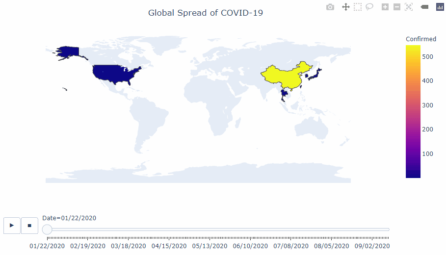

#### Visualisation of the infamous 'R' value.
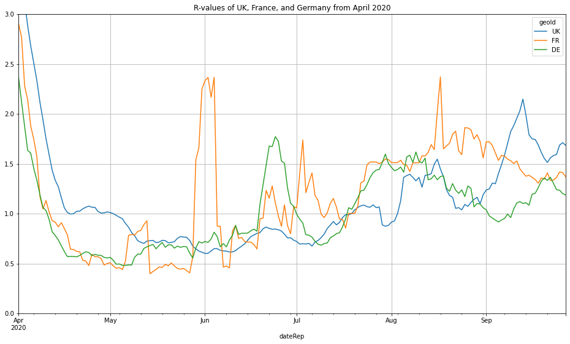

#### Number of active cases
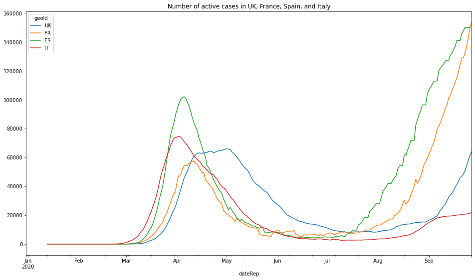

#### Proportion of global deaths
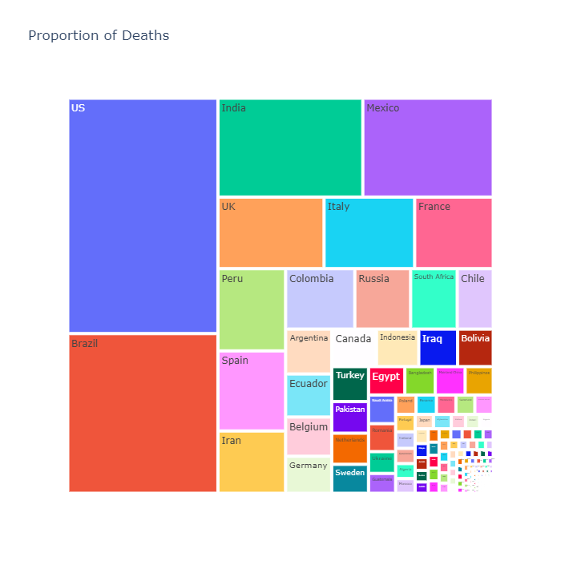

The links for these notebooks can be found [here](https://github.com/vincentlam13/code/blob/master/data-visualisation/matplotlib/EUCDC-covid-19-analysis/COVID-19%20analysis%20of%20EUCDC%20data.ipynb) and [here.](https://github.com/vincentlam13/code/blob/master/data-visualisation/plotly/COVID-19_analysis/global_COVID-19_analysis.ipynb)

 
<b>Climbing crag selector</b>

 
Overview of the project: 
- Created a tool to help decide which climbing crags to focus on for future climbing trips, with the goal to improve the climbing grades of my friends and I.
- Scraped over 4000 routes/problems for the climbing destination in question.
- I will update this repositry as I analyse more climbing destinations and update whether my efforts were successful.

 [Link](https://github.com/vincentlam13/climbing-crag-selection) to project. 

### EDA
Below are a few insights gleamed from the routes analysis.

Breakdown of climbing disciplines in Dorset

Breakdown of sport grade distribution

7a routes sorted by number of logs

I filtered out crags that had at least two 7a routes that had been logged 100 times on ukc.

Based on this data analysis we will be going to Blacknor South, Winspit, and Cheyne Weares Area. The list of potential routes are shown in table below.

|  Crag | Route  | Star | Height (m)  | Notes  |
|---|---|---|---|---|
| Blacknor South  | Sacred Angel  | ** | 15  | Easy up to ledge, then fingery crux with pockets |
| Blacknor South  | To Wish the Impossible   | *** | 20  | Sustained with delicate & fingery climbing, lots of rests, big moves off jugs  |
| Winspit  | Peppercorn Rate  | **  | 20  | Tough and pumpy with a blind crack  | 
| Winspit  | Exuberence  |  * | 20  | One hard bit at top, not so many onsightsbut alot of redpoints  | 
| Winspit  | Ancient order of Freemarblers  | **  | 20  | Steep stamina climbing, decent proportion of onsights  | 
| Winspit  | Gallows' Gore  |  ** | 20  | Powerful start about a V3/V4, but high rate of onsight and redpoints  | 
| Winspit  | Agonies of a Dying Mind  |  * | 20  | Powerful start about a V3/V4, but high rate of onsight and redpoints  | 
| Cheyne Weares Area  | The Accelerator  | *  | 7  |  Sounds super soft and pump shouldn't be a factor! | 

### Future Improvements
- Automate the analysis process for future climbing trips, likely destinations include the Peak Districtm Southern Sandstone, Costa Blanca, and Chamonix.
- Screenshot and scrape the bar chart information on style of ascents and voting of the route diffulty, and sort the routes by highest percent that have been onsighted or by 'softness'. Example shown below.

 
 Please see below findings:

 
<b>Golf tournament predictor</b>

 
Project overview: 
 - Created a tool to predict likely winners of PGA tournaments.
- Scraped PGA stats website for useful determinative data.
- Created new metrics to predict winners based on domain knowledge.
- Created a script to send the DataFrame csv file to google sheets, using gspread (a Python API for Google Sheets).
- Created a function to test model against historic data.

 [Link](https://github.com/vincentlam13/golf-tournament-predictor) to project. 
 
 ## Testing Prediction Against Historic Tournaments

| Year  | Tournament  | Golfer  | Predictive Ranking  | Real Position  |
|---|---|---|---|---|
|  2019 | The Open Championship  | Brooks Koepka  |  11 |  4 |
| 2018  | The Open Championship  | Justin Rose  | 4  | 2  |
| 2017  | The Open Championship |  Jordan Spieth | 4  |  1 |
| 2017  | US Open  |  Rickie Fowler | 2  |  5 |
|  2016 | The Open Championship  | Sergio Garcia  | 6  | 5  |
|  2014 | PGA Championship  | Rory Mcllroy  | 1  |  1 |

## Classification problems

 
<b>Telecoms Customer Churn Predictor</b>

 

Churn is a large issue in the telecomms industry. The aim of this notebook is to predict customer behaviour and maximimse customer retention and prevent churning. 
The following models were trained and evaluated:
- Logistic regression
- Random forest
- Support vector machines
- ADA Boost
- XG Boost

[Link](https://github.com/vincentlam13/code/blob/master/machine-learning/classification/Telecoms%20Churn%20Prediction.ipynb) to this notebook. This IBM Sample data set has been provided at the following [link.](https://www.kaggle.com/blastchar/telco-customer-churn) This notebook follows the example by [Atindrabandi.](https://www.kaggle.com/bandiatindra/telecom-churn-prediction)

### EDA

#### Churn by Telecom Service Type

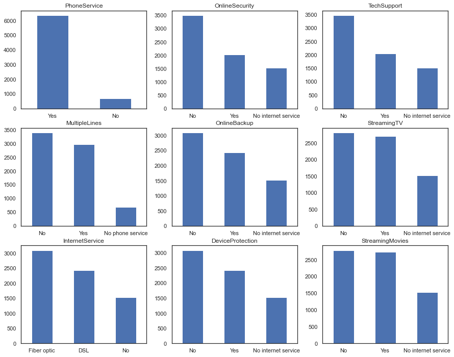

#### Churn by Contract Type

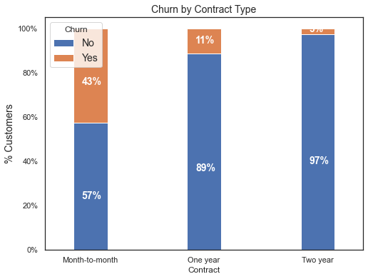

### Evaluation

#### Random Forest Feature Weightings

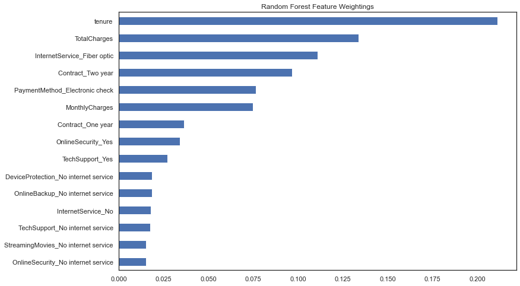

### Conclusion
AdaBoost classifier provided the highest classifier accuracy. However, accuracy is not necessarily the best metric for comparing models, as accuracy as a metric defines a false positive error and false negative error as equals which is rarely the case in business scenarios.

For example it would be better for a telecoms company if a false positive occurred than a false negative. In this scenario, a false positive is when a customer is wrongly predicted to churn and then receive communications to prevent them from churning. Whereas a false negative would mean a customer that should have been contacted to prevent churning was not and did end up churning, whcih will end up costing the business.

Using this metric of minimising false negatives, we see that SVM is the best performing algorithm.

### Logistic Regression

 
<b>Titanic Survivor Logistic Classifcation</b>

 
 The aim of the notebook is to use logistic regression to classify whether or not a passenger on the Titanic survived based on passenger information. 
 
 The [link](https://github.com/vincentlam13/code/blob/master/machine-learning/regression/logistic-regression/titanic-logistic.ipynb) to this notebook. This notebook was created in conjunction with the Data Science Bootcamp course. 

 
<b>Advert Click Logistic Classifcation</b>

 
The aim of the notebook is to classify whether or not a particular internet user clicked on an Advertisement. A logistic regression model will predict whether or not they will click on an ad based off the features of that user. 

The link to this notebook can be found [here.](https://github.com/vincentlam13/code/blob/master/machine-learning/regression/logistic-regression/advertising-data.ipynb) This notebook was created in conjunction with the Data Science Bootcamp course. 

### Random Forest

 
<b>Sales predictor with random forest regressor pipeline</b>

 
The aim of this notebook is to predict Big Mart sales, through the use of information about the stores, products, and historical sales data. A machine learning pipeline was used to automate the iterative processing steps. 

The link to this notebook can be found [here.](https://github.com/vincentlam13/code/blob/master/machine-learning/classification/random-forest/sales-predictor%20with%20pipeline.ipynb) This notebook uses the [BigMart Sales data](https://datahack.analyticsvidhya.com/contest/practice-problem-big-mart-sales-iii/) and follows the example by [Lakshay Arora.](https://www.analyticsvidhya.com/blog/2020/01/build-your-first-machine-learning-pipeline-using-scikit-learn/)

 
<b>Kyphosis Random Forest Classification</b>

The aim of the notebook is to classify whether or not a child has Kyphosis, a spinal condition, based on their age in months and number of vertebrae involved in the operation. This notebook compares the results between a decision tree and random forest classifier. 

The link to this notebook can be found [here.](https://github.com/vincentlam13/code/blob/master/machine-learning/classification/random-forest/kyphosis-with-decision-trees-and-random-forest.ipynb) This notebook was created in conjunction with the Data Science Bootcamp course. 

### XGBoost

Hourly Energy Consumption Forecasting

 
The aim of this notebook is to predict hourly power consumption based on data from PJM using time series forecasting with XGBoost. 

Link for this notebook can be found [here.](https://github.com/vincentlam13/code/blob/master/machine-learning/classification/xgboost/hourly-energy-consumption-forecasting/hourly%20energy%20consumption%20forecasting%20with%20XGBoost.ipynb)  
This notebook uses data from the following [link](https://www.kaggle.com/robikscube/hourly-energy-consumption) and follows the example of [Rob Muller.](https://www.kaggle.com/robikscube/tutorial-time-series-forecasting-with-xgboost)

### Support Vector Machines

 
<b>Breast Cancer SVM Classification</b>

 
This notebook uses a Support Vector Machine classifier to predict whether a patient's breast cancer is benign or malignant based on the size of the breast tumour features. A gridsearch was incorporated to find the best parameters. 

The link to this notebook can be [here.](https://github.com/vincentlam13/code/blob/master/machine-learning/classification/support-vector-machines/breast-cancer-SVM.ipynb) This notebook was created in conjunction with the Data Science Bootcamp course.

 
<b>Iris Flower SVM Classification</b>

 
The data set consists of 50 samples from each of three species of Iris (Iris setosa, Iris virginica and Iris versicolor), so 150 total samples. Four features were measured from each sample: the length and the width of the sepals and petals, in centimeters. This notebook uses these four features to predict what type of iris flower it is, using a support vector machine classifier. 

The link to this notebook can be found [here.](https://github.com/vincentlam13/code/blob/master/machine-learning/classification/support-vector-machines/iris-flower-SVM.ipynb) This notebook was created in conjunction with the Data Science Bootcamp course. 

## Natural Lanugage Processing

 
<b>Amazon Fine Foods Sentiment Analysis</b>

 
The purpose of this notebook is to make a prediction model that predicts whether a recommendation is positive or negative. This will be achieved by building a Term-document incidence matrix using term frequency and inverse document frequency. 
 
 The performance of three machine learning algorithms were compared and visualised with a ROC curve:
 - Multinomial Naive Bayes Classifier
- Bernouli Naive Bayes Classifier
- Logistic Regression

[Link](https://github.com/vincentlam13/code/blob/master/natural-language-processing/sentiment-analysis/amazon-reviews-sentiment-analysis/amazon-reviews-sentiment-analysis.ipynb) to project. The data has been provided on [kaggle.](https://www.kaggle.com/snap/amazon-fine-food-reviews) This notebook follows the example by [Eugen Anghel.](https://www.kaggle.com/eugen1701/predicting-sentiment-and-helpfulness)

 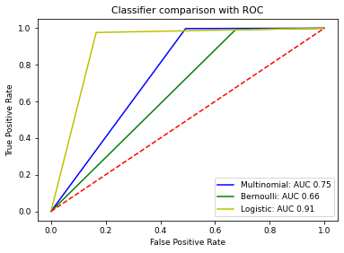
 
 The ROC curve shows that the Logistic Regression Classifier provided the best results. Although the AUC value can be improved further.
 
 #### Visualisation of sentiment analysis of food reviews
 
 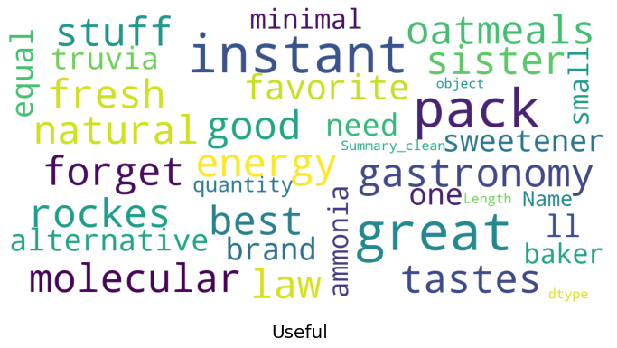
 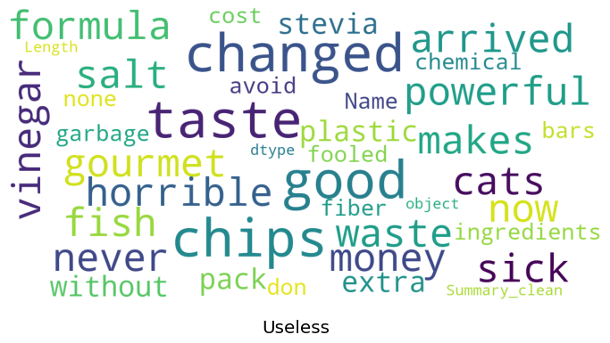

 
<b>Traditional Text Classification</b>

This notebook explores traditional approaches to text classification, using Naive Bayes, Support Vector Machines, and Logistic Regression classifiers. These approaches were used before deep learning was applied to Natural Language Processing. These methods are still quick and effective for training a text classifier. The data set used in this notebook is the 20 Newsgroups data set, which is a classic collection of text documents that is often used as a benchmark for text classification models. The set contains texts about differing topics. 

The link to this notebook can be found [here.](https://github.com/vincentlam13/code/blob/master/natural-language-processing/text%20classification%20with%20scikit-learn%20and%20grid%20search.ipynb) This notebook follows the example of [Yves Peirsman.](https://github.com/nlptown/nlp-notebooks/blob/master/Traditional%20text%20classification%20with%20Scikit-learn.ipynb)

 #### Confusion matrix for SVM text classifier

 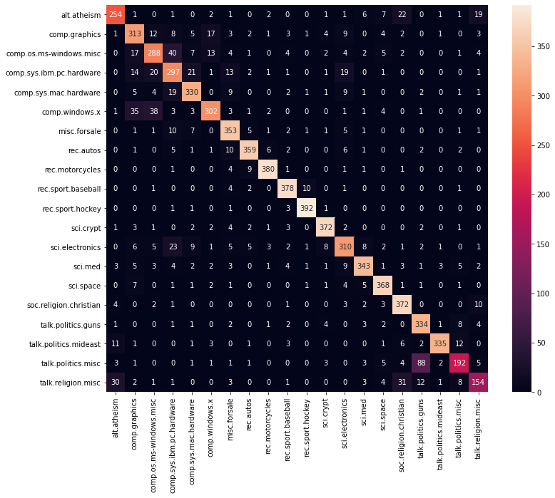
 
 ### eli5 visualisation of best feature weightings for each class
 
 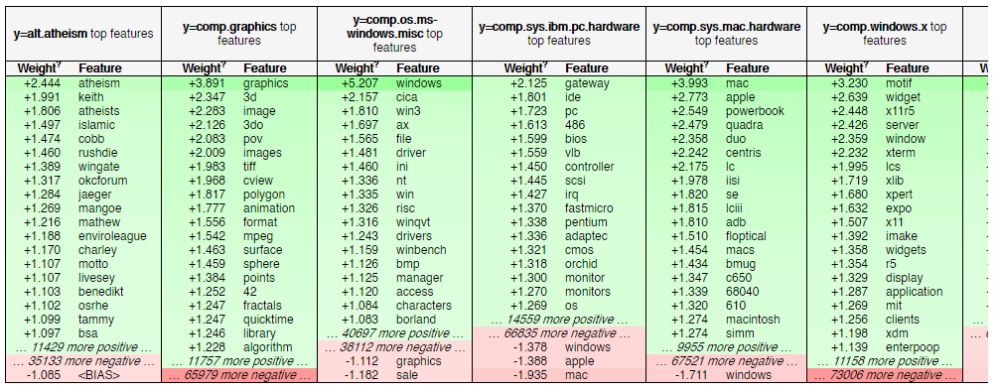

 
<b>Yelp reviews classification</b>

 
The aim of the notebook is to classify Yelp Reviews into 1 star or 5 star categories based off the text content in the reviews. 

The link to this notebook can be found [here.](https://github.com/vincentlam13/code/blob/master/natural-language-processing/yelp-reviews-NLP.ipynb)
This notebook was created in conjunction with the Data Science Bootcamp course. 

 
<b>Spam text messages classification</b>

 
The aim of the notebook is to classify SMS messages into whether they are spam or legitimate messages.  

The link to this notebook can be found [here.](https://github.com/vincentlam13/code/blob/master/natural-language-processing/spam-sms-NLP.ipynb)
This notebook was created in conjunction with the Data Science Bootcamp course. 

## Clustering
### Clustering with KMeans

 
<b>Online retail customer clustering with K-Means and hierarchical clustering</b>

 

The aim of this notebook is to use a cluster the online retail customers for targeted marketing oppurtunities.
The data consists of transactions for a UK online retail store that specialises in gifts.

The link to this notebook can be found [here.](https://github.com/vincentlam13/code/blob/master/machine-learning/clustering/K-Means/Online%20retail%20clustering.ipynb) This notebook uses data provided on [Kaggle](https://www.kaggle.com/hellbuoy/online-retail-customer-clustering) and follows the example by [Manish Kumar.](https://www.kaggle.com/hellbuoy/online-retail-k-means-hierarchical-clustering)

 
<b>University clustering</b>

 
 The aim of the notebook is to cluster universities into being a private or public school. 
 
 The link to this notebook can be found [here.](https://github.com/vincentlam13/code/blob/master/natural-language-processing/spam-sms-NLP.ipynb) 
This notebook was created in conjunction with the Data Science Bootcamp course. The aim of the notebook is to cluster universities into being a private or public school. 

## Linear Regression

 
<b>Life Expectancy Predictor with PyTorch Linear Regression</b>

 
<b>Insurance Cost Predictor with PyTorch Linear Regression</b>

 
<b>House Price Prediction</b>

The aim of the notebook is to predict US house prices using linear regression, based on a number of features:
- Average area income
- Average area house age
- Average area number of rooms
- Average area number of bedrooms
- Area population
- Price
- Address

The link to this notebook can be found [here.](https://github.com/vincentlam13/code/blob/master/machine-learning/regression/linear-regression/US-housing-linear-regression.ipynb) This notebook was created in conjunction with the Data Science Bootcamp course. 

 
<b>Ecommerce User Experience Linear Regression</b>

 An Ecommerce company based in New York City that sells clothing online but they also have in-store style and clothing advice sessions. Customers come in to the store, have sessions/meetings with a personal stylist, then they can go home and order either on a mobile app or website for the clothes they want. The company is trying to decide whether to focus their efforts on their mobile app experience or their website. This notebook aims to solve their problem.
 
The link to this notebook can be found [here.](https://github.com/vincentlam13/code/blob/master/machine-learning/regression/linear-regression/ecommerce-linear-regression.ipynb)
This notebook was created in conjunction with the Data Science Bootcamp course.

## Neural networks

### Regression

 
<b>House Price Predictor with TensorFlow</b>

 
This notebook predicts US house prices using TensorFlow linear regression by using many housing features.

Link to notebook can be found [here.](https://github.com/vincentlam13/code/blob/master/deep-learning/TensorFlow/house-price-predictor-TF-regression.ipynb)
This notebook was created in conjunction with the Data Science Bootcamp course. 

#### Geographical visualisation of house prices

The below figure shows that Seattle houses are more expensive when they are waterfront properties.

#### House price predictions

The below figure shows how the top 1% houses are skewing the predictions. The mode could be retrained on only the bottom 99% of houses.

#### Model losses

The figure below shows that the loss and validation loss plots are similar and have no spikes, this means that there can be further training without risk of overfitting to the training data.

### Classification

 
<b>IMDB Reviews Sentiment Analysis</b>

 
This notebook uses TensorFlow neural networks to solve the Sentiment Analysis on Movie Reviews Kaggle competition. The dataset contains syntactic subphrases of Rotten Tomatoes movie reviews. The task is to label the phrases as positive or negative on a scale from 1 to 5. The aim is not label the entire review, but individual phrases from within the reviews, which is a more difficult task. 

Link to notebook can be found [here.](https://github.com/vincentlam13/code/blob/master/deep-learning/TensorFlow/movie-reviews-TF-text-classification.ipynb) This notebook follows a TensorFlow [tutorial.](https://www.tensorflow.org/hub/tutorials/tf2_text_classification)

 
<b>Breast Cancer Classification using TensorFlow</b>

This notebook uses TensorFlow neural networks to classify patients' breast cancer as benign or malignant based on the size of the breast tumours features. 
The TensorFlow model consisted of:
- Three layers, going from 30 nodes to 15 to 1
- The first two layers had a Rectified Linear Unit activation function, and the last was a sigmoid activation function
- The loss function selected was binary crossentrophy and the optimiser was Adam
- Earlystopping via validation loss was used to prevent further losses
- Overfitting was prevented by using dropout layers, to turn off a percentage of neurons randomly

Link to notebook can be found [here.](https://github.com/vincentlam13/code/blob/master/deep-learning/TensorFlow/breast-cancer-TF-classification.ipynb)
This notebook was created in conjunction with the Data Science Bootcamp course.

#### Model Evauluation

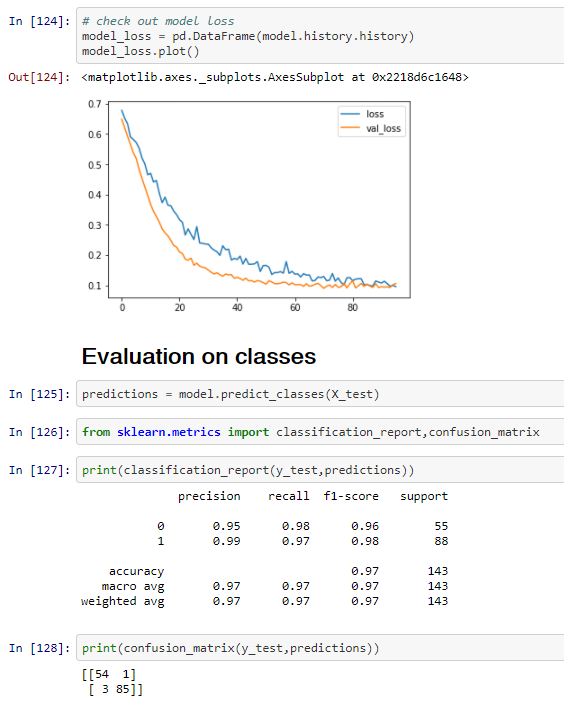

 
<b>Bank Note Authentication TensorFlow Classification</b>

 
The aim of this notebook is to predict whether or not a bank note is authentic or not based on the features of the bank note. The Bank Authentication dataset is from the UCI repository.

The data consists of 5 columns:
- variance of Wavelet Transformed image (continuous)
- skewness of Wavelet Transformed image (continuous)
- curtosis of Wavelet Transformed image (continuous)
- entropy of image (continuous)
- class (integer)

Where class indicates whether or not a Bank Note was authentic.

The link to this notebook can be found [here.](https://github.com/vincentlam13/code/blob/master/deep-learning/TensorFlow/bank-note-authentication-TF.ipynb)
This notebook was created in conjunction with the Data Science Bootcamp course. 

 
<b>Loan Lending Predictor with TensorFlow</b>

The aim of this notebook is to predict whether or not a new potential customer will be able to pay back their loan. 

Link to notebook can be found [here.](https://github.com/vincentlam13/code/blob/master/deep-learning/TensorFlow/Loan-lending-predictor-tensorflow.ipynb)
This notebook was created in conjunction with the Data Science Bootcamp course. 

## Recommendations Systems
### MovieLens 

## Courses & Certificates

* Machine Learning:
  * [Python for Data Science and Machine Learning Bootcamp](https://www.udemy.com/certificate/UC-70ca0a85-cd1a-487c-9795-7686a89c1827/) (June 2020) (Udemy - Jose Portilla)

* SQL:
  * SQL for Data Analysis (Udacity)
  
* PowerBI:
  * [Microsoft Power BI - Up & Running with Power BI Desktop](https://www.udemy.com/certificate/UC-02014d8f-874f-4e5c-8ec5-c6e5d602ac0f/) (September 2020) (Udemy - Maven Analytics)

* Programming languages:
  * Intro to Python (April 2020) (365 Data Science)
  * [Automate the Boring Stuff with Python Programming](https://www.udemy.com/certificate/UC-4dd14984-5141-4d50-8d38-dfe7af4906b1/) (May 2020) (Udemy - Al Sweigart)
  
* Analytics
  * Google Analytics for Beginners (August 2020)
  * KPMG Data Analytics Consulting Virtual Internship (October 2020)

* Statistics
  * [Data Science Math Skills](https://www.coursera.org/verify/3BTMH7PYJLK5) (December 2020) (Coursera - Duke University)
  
  
